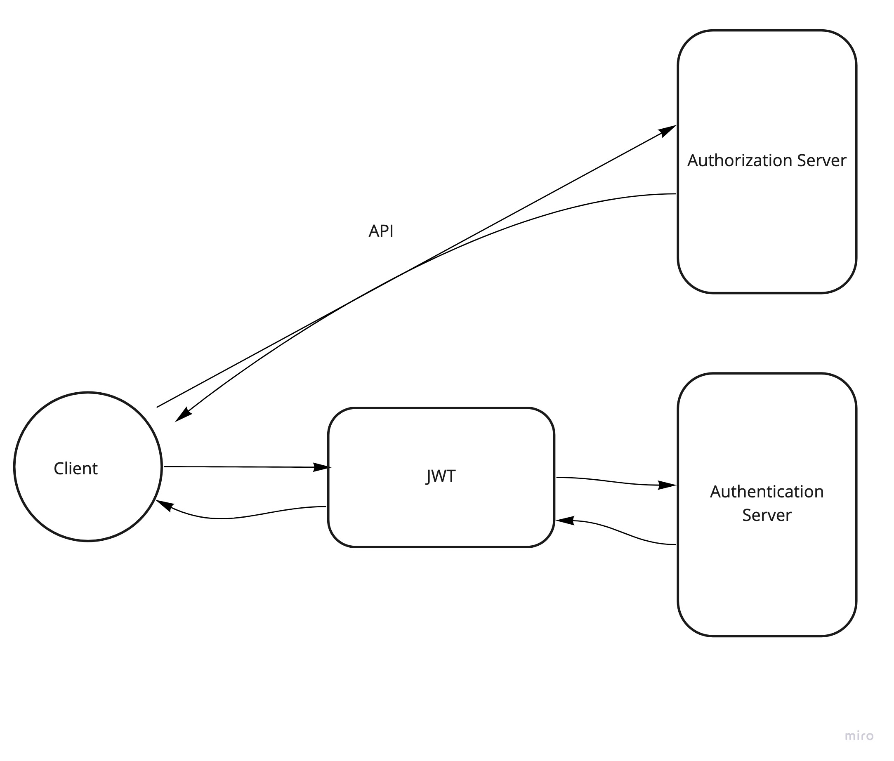

# bearer-auth

# basic-auth

# LAB - Class 7

## Project: bearer-auth

### Author: Arthur Lozano Jr

- [miro](https://miro.com/app/board/o9J_lP73x4k=/) (miro board)
- [front-end application](https://bearauth.herokuapp.com/) (Heroku)
- [Jest](https://jestjs.io/) (Jest)
- [ci/cd](https://github.com/Arthur-Lozano/bearer-auth/tree/main/.github/workflows) (GitHub Actions)
- [Pull Request] (https://github.com/Arthur-Lozano/bearer-auth/pull/3) 

### Setup

#### `.env` requirements (where applicable)
- `PORT` - 3333

#### How to initialize/run your application (where applicable)

- npm start
- `nodemon`

#### How to use your library (where applicable)

#### UML

